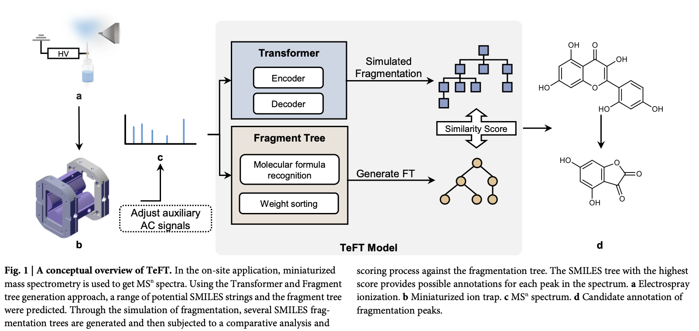

# Structural annotation of unknown molecules in a miniaturized mass spectrometer based on a transformer enabled fragment tree method

## Purpose

Generate specific structure of molecules from mass spectrometry spectra.

To discover new homologous derivatives, natural product research, non-targeted metabolomics, drug research, food safety, pharmaceutical ingredient analysis, drug detection.

## Interpretaion of mass spectra

One common approach to automatically interpret MS$^{n}$ is to search in a mass spectrometry database.

Compares (**through similarity measure**) mass spectra of compounds under specific conditions with a database containing a large number of reference mass spectra.

## X-Rank
X-Rank algorithm to rank peak intensities of mass spectra, establish correlations between different mass spectra, determine the probability of matching with mass spectra from a reference library, enable crss-mass spectrometry platform recognition.

## Database search algorithms

### MetFrag

Combine database search algorithms and fragment prediction algorithms for identifying the structure of small molecules from tandem mass spectrometry data.

Identifies compounds not yet included in mass spectrometry databases.

### SIRIUS series methods

More effective mass spectrometry database search algorithm. 

It uses:

- High-resolution isotope pattern analysis
- Fragment tree (FT)
- CSI: FingerID (search molecular databases)

### Disadvantages

- Inability to identify unknown natural products and drug metabolites.
- Miniaturized mass spectrometer used for on-site testing, it is difficult to provide corresponding databases for searching.

## Context of commonly used Deep learning models 

### Advantage

- Can generate molecular structures from mass spectrometry spectra without being given explicit rules. Uses molecular-input line-entry system strings and molecular graph constructuon (SMILES).

### CANOPUS

SVM and DNN

### MassGenie: Transformed-based DNN

Transforms the molecular recognition probelm into a language translation problem, where the source language is a list of high-resolution mass spectra peaks, and the translation language is the SMILES strings of the molecule.

### DarkNPS

Based on LSTM for automatic structural analysis of new psychoactive substances.

### MSNovelist

Encode-Decoder network to achieve de nove prediction of the structure of unkown compunds from tandem masss spectrometry.

## Transformer enabled Fragment Tree (TeFT)

Miniaturized mass spectrometer with low resolution spectra for 16 flavonoid alcohols.

- Simulated semantic fragment tree model (SMILES tree) generated through the deep learning Transformer module and the FT directly generated through the original MS$^{n}$ spectral data.

- Compares similarity of the 2 trees to predict the molecular structure of the tested chemical substance.

### Obtaining data

MS$^{n}$ spectra were obtained using high-resolution isolation and collision-induce dissociation (CID) sequences by carefully controlling the frequency and amplitude of the AC signal applied to the ion trap.

The training set utilized was created by compiling open-source spectrometry databases GNPS, HMDB and MoNA.

- Molecular weight < 500 Da
- Presence of C,H,O,N,P,S,Cl,Br,I,F

### Workflow

<figure markdown="span">
  { width="400" }
  <figcaption>Workflow used by this reference</figcaption>
</figure>

1. MS$^{n}$ spectral data -> Transformer -> List of SMILES strings for the molecule

2. Candidate list -> Simulated fragmentation -> Series of SMILES trees

MS$^{n}$ spectra data are sorted according to peak intensities and several fragments with the highest intensity are selected as inputs for the deep learning Transforme module.

### Preprocessing

### Similarity Metrics

All similarities presented here compare the molecular fingerprints (i.e. Morgan) of the two molecules

- Dice similarity:

$$
\frac{2c}{a+b-c}
$$

- Tanimoto:

$$
\frac{c}{a+b-c}
$$

- Euclidean:

$$
\sqrt{a + b - 2c}
$$

Where:

- a is the number of on bits in molecule A
- b is number of on bits in molecule B
- c is the number of bits that are on in both molecules
- d is the number of common off bits
- n is the bit length (total number of bits) of the fingerprint: $n = a + b − c + d$.

